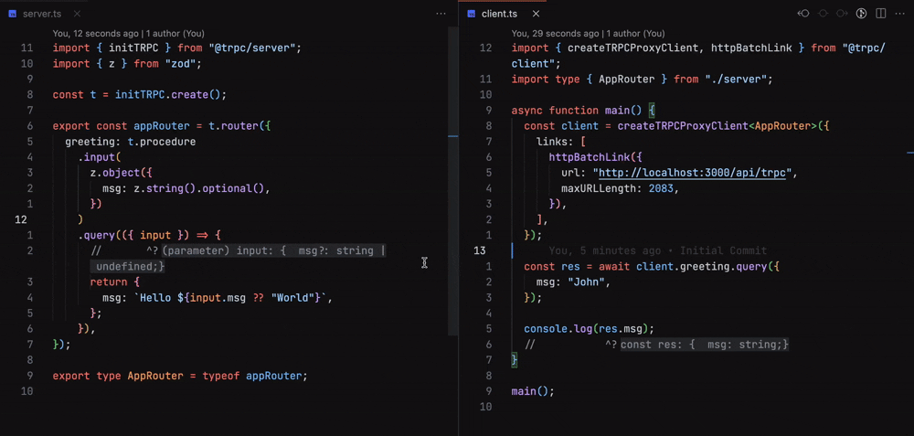

# React Fullstack Template

A flexible fullstack template combining React (Vite), TypeScript, tRPC, and Tailwind CSS on the frontend with a Node/TypeScript tRPC server on the backend. Designed for rapid development of modern web apps with end-to-end type safety.

<!-- tRPC demo GIF placeholder -->



## What is tRPC?

[tRPC](https://trpc.io/) is a framework for building end-to-end type-safe APIs without code generation. It lets you define your API procedures on the server with full TypeScript support and consume them on the client with auto-inferred types.

### Server-side Example

```ts
// apps/backend/src/server.ts
import { initTRPC } from '@trpc/server';
import { z } from 'zod';

const t = initTRPC.context<{}>().create();

export const appRouter = t.router({
    greeting: t.procedure.input(z.string()).query(({ input }) => ({ message: `Hello, ${input}!` })),
});

export type AppRouter = typeof appRouter;
```

### Client-side Example

```ts
// apps/frontend/src/utils/trpc.ts
import { createTRPCProxyClient, httpBatchLink } from '@trpc/client';
import type { AppRouter } from 'backend';

export const trpc = createTRPCProxyClient<AppRouter>({
    links: [httpBatchLink({ url: import.meta.env.DEV ? 'http://localhost:2022' : '/api/trpc' })],
});
```

In React components:

```ts
const greetingQuery = trpc.greeting.useQuery('World');
```

## Features

- **Frontend**
    - React Vite for fast HMR
    - TypeScript for type safety
    - Tailwind CSS for utility-first styling (dark/light mode)
    - tRPC client for end-to-end typed API calls
    - React Router v6 for routing
- **Backend**
    - Node.js with TypeScript
    - tRPC server providing typed endpoints
    - Zod for input validation
    - CORS support
- **Monorepo**
    - pnpm workspace
    - Concurrent dev script across both apps
    - Prettier formatting

## Prerequisites

- Node.js v18+
- pnpm v7+ (or install via `npm i -g pnpm`)

## Getting Started

1. Clone the repo:

    ```bash
    git clone <repo-url>
    cd react-fullstack-template
    ```

2. Install dependencies:

    ```bash
    pnpm install
    ```

3. Start both frontend and backend in development mode:

    ```bash
    pnpm dev
    ```

    - Frontend runs at http://localhost:3000 by default (configured in `apps/frontend/vite.config.ts`).
    - Backend runs at http://localhost:2022.

4. Open http://localhost:3000 to view the app.

## Scripts

In the monorepo root:

- `pnpm dev` - concurrently starts frontend and backend in watch mode.
- `pnpm build` - builds the frontend (output in `apps/frontend/dist`).
- `pnpm format` - runs Prettier on the entire workspace.

In **`apps/backend`**:

- `pnpm dev` - start backend in watch mode (`tsx watch src/server.ts`).
- `pnpm build` - compile TypeScript to `dist/`.
- `pnpm start` - run the compiled server.
- `pnpm lint` - run ESLint on backend code.

In **`apps/frontend`**:

- `pnpm dev` - start Vite dev server.
- `pnpm build` - build production assets.
- `pnpm preview` - preview the production build.

## Environment Variables

Both frontend and backend use environment variables. Copy `.env.example` files if provided or set:

- `VITE_TRPC_URL` - URL for tRPC API (defaults to `http://localhost:2022` in development).

## Project Structure

```
├── package.json          # Root workspace config
├── pnpm-workspace.yaml   # pnpm workspace definition
├── apps/
│   ├── backend/          # tRPC server
│   │   ├── src/
│   │   └── package.json
│   └── frontend/         # React Vite app
│       ├── src/
│       └── package.json
└── api/                  # Vercel/Next.js API (if deploying)
    └── trpc/
```

## Deployment

**Frontend**: can be deployed to Vercel, Netlify, or any static host.  
**Backend**: standalone tRPC server or via serverless functions (the `api/trpc` folder is configured for Vercel deployments).

### Full Stack deployment on Vercel :

- In the Vercel Dashboard, create a new project and connect your repository.
- Under **General → Framework Preset**, select `Vite`.
- Under **Build & Development Settings**:
    - **Install Command**: `pnpm install`
    - **Build Command**: `pnpm build`
    - **Output Directory**: `apps/frontend/dist`
- Click **Deploy** — your first build **will fail** due to Vercel's default root.
- After the failure, go to **Settings → Build & Deploy** and **clear all Root Directory fields** (leave blank).
- Redeploy; the build will now run from the monorepo root successfully.

> **Important:** The first deployment always fails; clearing the **Root Directory** fields under **Settings → Build & Deploy** after the error is required for subsequent builds to succeed.
